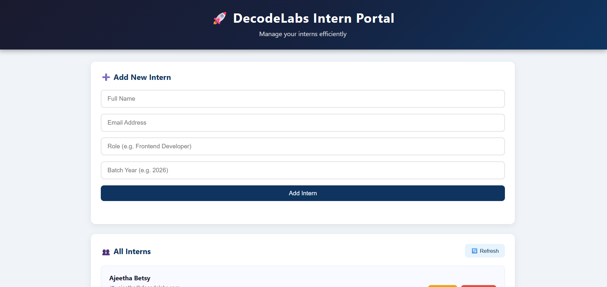
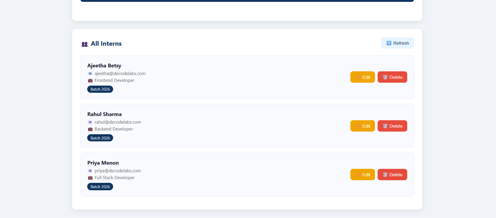
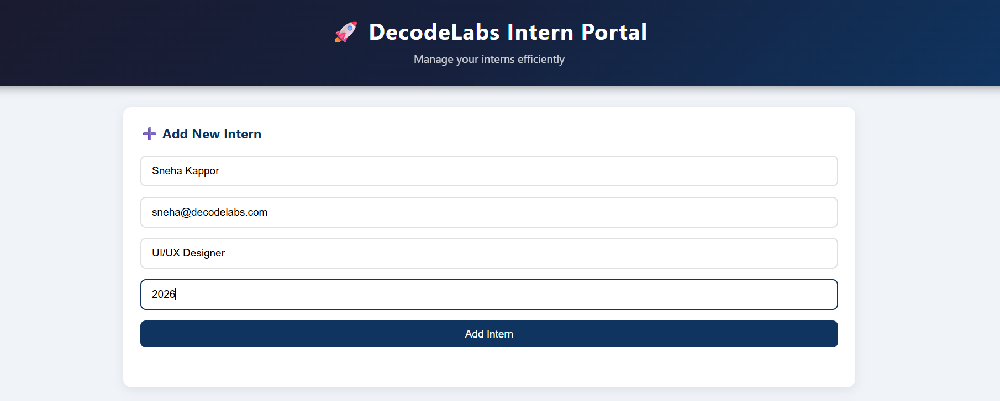
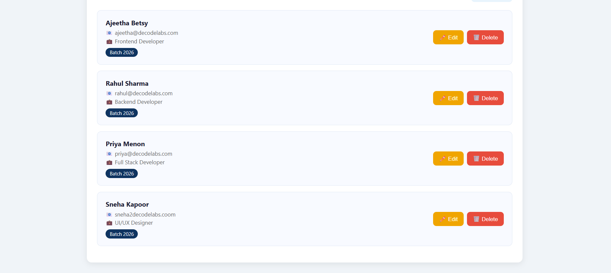
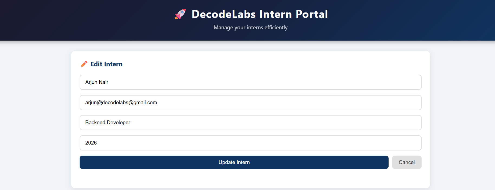
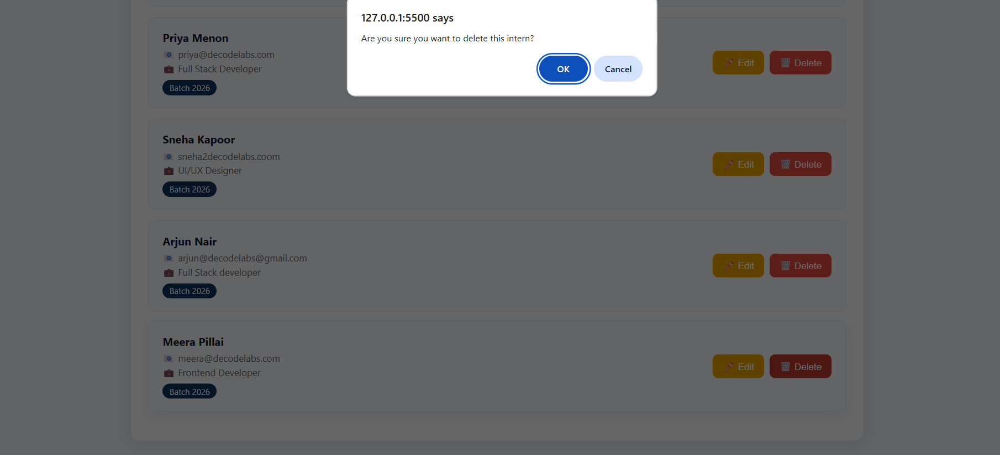
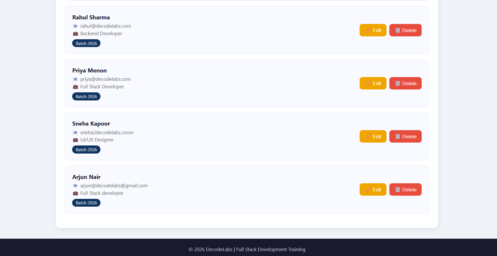

# 🚀 Intern Manager

A Full Stack Web Application for managing intern records with complete Frontend and Backend integration using Node.js, Express.js, and Vanilla JavaScript, developed as part of the Full Stack Development Industrial Training Kit (Project 4: Bridging the gap between Frontend and Backend!)

---

## 📌 Project Overview

This project demonstrates complete **Frontend & Backend Integration** using Node.js, Express, and Vanilla JavaScript. It allows users to manage interns by performing full CRUD operations through a REST API.

Project 4 is the **Optional Mastery Phase** of the DecodeLabs Full Stack Development Training. 

This project bridges the gap between isolated frontend and backend systems by building a unified full stack application. It demonstrates the complete data flow of a web application — from user interaction on the browser, through REST API calls, to server processing and back to dynamic UI updates.

Key concepts demonstrated:
- REST API integration
- Asynchronous JavaScript (async/await)
- JSON data parsing and serialization
- CORS handling
- Error handling with try/catch
- Dynamic DOM manipulation

---

## ✨ Features

- ✅ View all interns dynamically
- ✅ Add a new intern
- ✅ Edit existing intern details
- ✅ Delete an intern
- ✅ Error handling with user friendly messages
- ✅ Responsive design for all screen sizes

---

## 🛠️ Tech Stack

| Layer | Technology |
|---|---|
| Frontend | HTML, CSS, JavaScript |
| Backend | Node.js, Express.js |
| Database | JSON File Storage |
| API | REST API |
| Tools | VS Code, Git, GitHub |

---

## 📁 Project Structure
```
intern-manager/
├── frontend/
│   ├── index.html
│   ├── style.css
│   └── app.js
├── backend/
│   ├── server.js
│   ├── data.json
│   └── package.json
├── screenshots/
│   ├── home1.png
│   ├── home2.png
│   ├── add-intern1.png
│   ├── add-intern2.png
│   ├── edit-intern.png
│   ├── delete-intern1.png
│   └── delete-intern2.png
└── README.md
```


---

## 📸 Screenshots

### 🏠 Home Page








### ➕ Add Intern








### ✏️ Edit Intern





### 🗑️ Delete Intern







---

## ⚙️ How to Run This Project

### Step 1 - Clone the Repository
git clone https://github.com/YourUsername/intern-manager.git

### Step 2 - Go to Backend Folder
cd intern-manager/backend

### Step 3 - Install Dependencies
npm install

### Step 4 - Start the Server
node server.js

### Step 5 - Open Frontend
Open `frontend/index.html` with Live Server in VS Code

### Step 6 - View in Browser
http://127.0.0.1:5500/frontend/index.html

---

## 🔗 API Endpoints

| Method | Endpoint | Description |
|---|---|---|
| GET | /api/interns | Get all interns |
| POST | /api/interns | Add new intern |
| PUT | /api/interns/:id | Update intern |
| DELETE | /api/interns/:id | Delete intern |

---

## 👩‍💻 Developer

**Ajeetha Betsy**